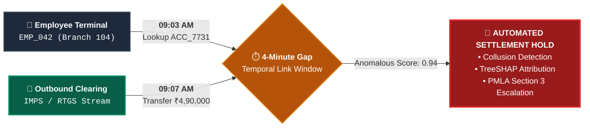

<div align="center">

# 🛡️ TemporalShield
### Multi-Tiered Financial Fraud Detection & Temporal Insider Threat Intelligence Platform

*Intercepting complex banking collusion, circular laundering rings, and hawala smurfing through sub-second temporal cross-correlation.*

<br/>

[](https://www.python.org/)
[](https://fastapi.tiangolo.com/)
[](https://react.dev/)
[](https://kafka.apache.org/)
[](https://pytorch.org/)
[](https://networkx.org/)
[](https://xgboost.ai/)
[](LICENSE)

<br/>

[Executive Summary](#-executive-summary) • [Headline Feature](#-headline-capability-the-4-minute-detection-window) • [Detection Pillars](#-core-detection-pillars) • [System Architecture](#-system-architecture) • [Regulatory Benchmarks](#-indian-regulatory-benchmarks) • [Quick Start](#-quick-start-guide) • [API Reference](#-api-endpoints-reference)

</div>

---

## 📌 Executive Summary

Traditional Bank Fraud Management Systems (FMS) operate on isolated data silos: internal access telemetry (Active Directory, Core Banking terminal logs) is never correlated in real-time with outbound transactional clearing streams (RTGS, NEFT, IMPS).

**TemporalShield** closes this vulnerability by running continuous, time-decayed graph cross-referencing between employee activity and fund transfers. It fuses **5 specialized machine learning engines** into a centralized risk aggregator to detect insider collusion, smurfing bursts, shell entity loops, and privilege misuse before settlement finality.

<br/>

<div align="center">

| ⏱️ **4-Minute Window** | 🎯 **< 1.5% FPR** | 🧠 **5 Ensemble Engines** | 📜 **RBI & PMLA Grounded** |
| :---: | :---: | :---: | :---: |
| Instant temporal link between internal employee lookup & external fund transfer. | Supervised TreeSHAP baseline filters ensure routine transactions proceed uninterrupted. | Isolation Forest, 5x Role Autoencoders, LSTM+Attention, XGBoost, and Node2Vec. | Directly benchmarked against Citibank India, PNB, Saradha, and Hawala syndicates. |

</div>

---

## ⚡ Headline Capability: The 4-Minute Detection Window

In documented banking insider frauds (e.g., *Citibank India 2010*), rogue relationship managers or branch operators inspect high-net-worth or dormant customer profiles to harvest account numbers, verify balances, or suppress security controls immediately prior to executing an unauthorized outbound transfer.



TemporalShield monitors the joint temporal manifold of access events and transaction events. When money moves within **4 minutes** of employee account access:
1. **Unsupervised Isolation Forest** computes the joint temporal-amount anomaly score.
2. **Exponential Graph Decay** ($w = e^{-\lambda \cdot \Delta t}$) dynamically raises the collusion edge weight.
3. An **Automated Settlement Hold** is triggered with full SHAP forensic attribution before funds clear.

---

## 🛡️ Core Detection Pillars

| Engine | Threat Class | Methodology | Case Benchmark |
| :--- | :--- | :--- | :--- |
| **Temporal Link Engine** | Insider Collusion | Unsupervised Isolation Forest over joint $\Delta t$, amount deviations, and branch role matches. | **Citibank India (2010)**<br/>₹400 Cr dormant account diversion |
| **Circular Ring Detector** | Money Laundering Cycles | NetworkX cycle discovery combined with Node2Vec structural embeddings to flag synthetic volume rings. | **Saradha Syndicate (2013)**<br/>₹2,500 Cr layered shell transfers |
| **Structuring Engine** | Hawala Smurfing | Bidirectional LSTM with Multi-Head Attention to detect sub-₹50,000 transaction bursts. | **Hawala Networks (Ongoing)**<br/>Smurfing below mandatory CTR limits |
| **Role Profiler** | Scope & Privilege Abuse | PyTorch Autoencoders (x5) scoring employee action sequences against historical peer distributions. | **PNB SWIFT Scam (2018)**<br/>₹11,400 Cr off-hours LoU issuance |
| **Account Profiler** | Dormant Hijacking | XGBoost Classifier + TreeSHAP explaining deviations against customer transaction baseline. | **Jan Dhan Laundering (2016)**<br/>Post-demonetization deposit bursts |

---

## 🧠 System Architecture

```
                       Live Event Ingestion / Replay Stream
           ┌───────────────────────────────────────────────────┐
           │ access_logs.csv (63k+)   synthetic_txns.csv (7k+) │
           └─────────┬─────────────────────────┬───────────────┘
                     ▼                         ▼
           ┌──────────────────┐       ┌──────────────────┐
           │ Topic: access    │       │ Topic: txns      │
           └─────────┬────────┘       └────────┬─────────┘
                     └────────────┬────────────┘
                                  ▼
                    ┌───────────────────────────┐
                    │ Streaming Consumer Loop   │
                    │ (Kafka / In-Memory Queue) │
                    └─────────────┬─────────────┘
                                  ▼
           ┌─────────────────────────────────────────────┐
           │ Incremental Temporal Graph (NetworkX)       │
           │ • Dynamic Time Decay: w = exp(-λ·Δt)        │
           │ • 4-Minute Bi-Directional Cross-Check       │
           └──────────────────────┬──────────────────────┘
                                  │
    ┌─────────────────────────────┼─────────────────────────────┐
    ▼                             ▼                             ▼
┌──────────────────┐     ┌──────────────────┐     ┌──────────────────┐
│ Isolation Forest │     │ Role Autoencoder │     │ LSTM + Attention │
│ 4-Min Link Window│     │ Privilege Abuse  │     │ Smurfing Burst   │
└────────┬─────────┘     └────────┬─────────┘     └────────┬─────────┘
         │ (Weight: 0.35)         │ (Weight: 0.05)         │ (Weight: 0.15)
         └────────────────────────┼────────────────────────┘
                                  ▼
    ┌─────────────────────────────┼─────────────────────────────┐
    ▼                             ▼                             ▼
┌──────────────────┐     ┌──────────────────┐     ┌──────────────────┐
│ XGBoost + SHAP   │     │ Circular Detector│     │ Node2Vec Embed   │
│ Profile Mismatch │     │ Saradha Cycles   │     │ Mule Clustering  │
└────────┬─────────┘     └────────┬─────────┘     └────────┬─────────┘
         │ (Weight: 0.20)         │ (Weight: 0.25)         │
         └────────────────────────┼────────────────────────┘
                                  ▼
              ┌───────────────────────────────────────┐
              │ Central Multi-Tier Risk Aggregator    │
              │ Composite Score (0-100) & Severity    │
              │ (CRITICAL / HIGH / MEDIUM / LOW)      │
              └───────────────────┬───────────────────┘
                                  ▼
              ┌───────────────────────────────────────┐
              │ RESTful FastAPI Backend (/docs)       │
              │ • Live Sub-Graph Snapshots            │
              │ • Evidence Dossier & TreeSHAP Drivers │
              │ • Demo Scenario Planner Replay        │
              └───────────────────┬───────────────────┘
                                  ▼
              ┌───────────────────────────────────────┐
              │ React + Vite Forensic Command Center  │
              └───────────────────────────────────────┘
```

---

## 🏛️ Indian Regulatory Benchmarks

Every alert generated by TemporalShield provides automated statutory alignment for compliance reporting:

| Alert Category | Severity | Statutory Grounding | Regulatory Provision |
| :--- | :---: | :--- | :--- |
| **Temporal Insider Collusion** | `CRITICAL` | **PMLA 2002, Section 3** | Offence of money laundering; RBI Master Direction on Fraud Classification (RBI/2016-17/13). |
| **Circular Shell Laundering** | `CRITICAL` | **FIU-IND Red Flag RFI-08** | Layered round-tripping of funds through multiple accounts with no apparent commercial rationale. |
| **Hawala Structuring** | `HIGH` | **PMLA 2002, Rule 3(1)(A)** | Mandatory filing of Cash Transaction Reports (CTR) for structured amounts under ₹50,000. |
| **Privilege / Scope Abuse** | `HIGH` | **IPC 409 & PCA 1988** | Criminal breach of trust by public servant/banker; mandatory SWIFT-CBS reconciliation. |
| **Dormant Account Hijacking** | `MEDIUM` | **Benami Transactions Act** | Sudden reactivation of low-volume accounts for high-value third-party disbursements. |

---

## 🧱 Core Modules

| Module | Location | Primary Responsibilities |
| :--- | :--- | :--- |
| **API Layer** | [`api/`](api/) | FastAPI routing, Pydantic data schemas, and SHAP evidence dossier generation. |
| **Streaming & Data** | [`data/`](data/) | Dual-topic event pipeline (Kafka with in-memory fallback), scenario replay, and PaySim loaders. |
| **Temporal Graph** | [`graph/`](graph/) | NetworkX incremental graph with exponential time decay, cycle detectors, and risk aggregator. |
| **Inference Models** | [`models/`](models/) | Model architectures and serialized weights for Isolation Forest, Autoencoders, LSTM, and XGBoost. |
| **Forensic Console** | [`frontend/`](frontend/) | React + Vite dashboard, live graph explorer, alert inspector, and scenario replay UI. |

---

## 🚀 Quick Start Guide

### 1. Prerequisites & Setup

```bash
# Clone the repository
git clone https://github.com/Dnyanesh-29/TemporalShield.git
cd TemporalShield

# Create and activate virtual environment
python -m venv .venv
source .venv/bin/activate       # macOS / Linux
.venv\Scripts\activate          # Windows

# Install Python requirements
pip install -r requirements.txt
```

### 2. Launch the Backend API

```bash
uvicorn api.main:app --reload --host 0.0.0.0 --port 8000
```

* **Interactive Swagger UI**: [http://localhost:8000/docs](http://localhost:8000/docs)
* **ReDoc Documentation**: [http://localhost:8000/redoc](http://localhost:8000/redoc)
* **System Health Check**: [http://localhost:8000/](http://localhost:8000/)

> [!NOTE]
> **Zero-Broker Streaming Fallback**: Apache Kafka is completely optional. If no Kafka broker is detected at startup, the system automatically falls back to thread-safe in-memory queues (`data/event_bus.py`). Everything runs immediately with zero external infrastructure!

### 3. Launch the React Frontend (Optional)

```bash
cd frontend
npm install
npm run dev
```

Open [http://localhost:5173](http://localhost:5173) in your browser to access the live dashboard.

---

## 🎬 Demonstration Scenarios

TemporalShield includes one-click simulation scenarios replicating documented financial crimes:

| Scenario Key | Threat Pattern | Description |
| :--- | :--- | :--- |
| `temporal_link` | Insider Collusion | Rogue employee lookup followed 4 minutes later by a ₹4.9L outbound transfer. |
| `structuring` | Hawala Smurfing | Rapid burst of sub-₹50,000 transfers hitting an account to evade CTR thresholds. |
| `circular_transfer` | Laundering Loop | Multi-hop circular cycle ($A \to B \to C \to A$) through shell accounts. |
| `clean_busy` | Normal Operations | High-velocity benign commercial transactions (validates false-positive rate $< 1.5\%$). |

#### Trigger via cURL:
```bash
# Replay 4-Minute Insider Link scenario
curl -X POST "http://localhost:8000/scenario" \
     -H "Content-Type: application/json" \
     -d '{"scenario": "temporal_link", "speed_multiplier": 500.0}'

# Fetch prioritized alerts
curl -X GET "http://localhost:8000/alerts"

# Retrieve full forensic evidence dossier
curl -X GET "http://localhost:8000/alerts/ALT_INIT_10017/evidence"
```

---

## 📡 API Endpoints Reference

| Method | Endpoint | Description |
| :---: | :--- | :--- |
| `GET` | `/` | System status, version, and active model healthcheck. |
| `GET` | `/alerts` | Active alert queue sorted by risk score and severity (`CRITICAL`, `HIGH`, `MEDIUM`). |
| `GET` | `/alerts/{id}` | Detailed alert breakdown with feature drivers and recommended actions. |
| `GET` | `/alerts/{id}/evidence` | Forensic evidence dossier: TreeSHAP contributions, PMLA benchmark, sub-graph. |
| `GET` | `/graph` | Current temporal graph snapshot (nodes, edges, time-decay weights). |
| `GET` | `/scenarios` | Catalogue of all pre-configured simulation scenarios. |
| `POST` | `/scenario` | Trigger on-demand streaming replay of a scenario. |
| `GET` | `/stats` | Live telemetry: processed events, false-positive rate, detected fraud topologies. |
| `DELETE` | `/reset` | Flush event queues, reset graph nodes, and restore baseline state. |

---

## 📜 License
This project is licensed under the [MIT License](LICENSE).
